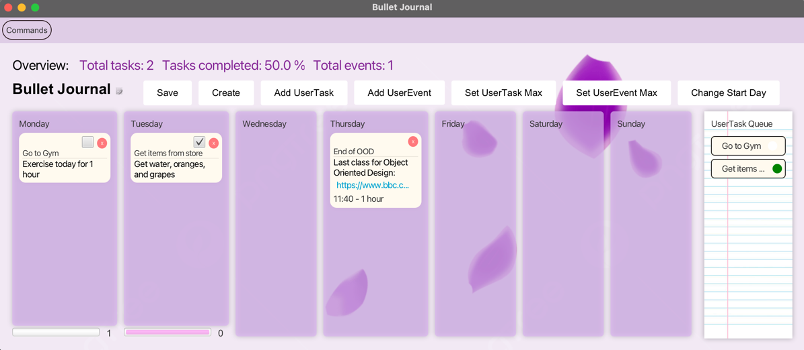

# 3500 PA05 Project Repo

## Pitch: 
Plan out and get organized with Bujo! Your one-stop application for all things planning, organizing, and journaling. 
Finally, there is one place to create helpful tasks and events, view them, and see your completion progress. This ease 
of use is accomplished through our helpful overview, progress bars, and task queue which make keeping track of progress
a breeze. Not to mention that deleting when mistakes are made and even including links to external pages are also 
made simple too. Download Bujo!

## SOLID principle use:

### Single responsibility -> 
There are many examples of single use principle throughout our project, but if you look at an example 
such as `TaskView` it highlights this perfectly. TaskView is responsible only for displaying the contents of a task 
and nothing else. A day view can hold a list of one or more Tasks, but each visual element is segmented into 
its own class which returns a component this makes code reuse significantly easier.

### Open-closed principle -> 
Our code highlights the use of open-closed because in order to add new features we only need to 
add new code, instead of having to modify old code in order to allow for new features. This can
be seen within with our highest level views, they implement a `SceneViw` interface which means 
that in order to create new SceneView which displays a new type of scene for the model
we can have another view implement the interface. 

### Liskov substitution ->  
Our code exemplifies Liskov Substitution through our creation/implementation of our 
AbstractHandler class. This class is used to abstract the general usage of the handle method from
the event handler class, and the extension of the model holder to decrease the need for coupling
in our lower modules. Because the class contains a model that can be mutated, all the lower modules
have no need for the class to be passed down. In terms of Liskov, any event handler we use in our code
could be replaced by another subtype of the AbstractHandler without impairing any of our
functionality.

### Interface segregation -> 
We implemented interface segregation when passing model information into the view
this can be seen looking at `public abstract class AbstractHandler extends ModelHolder implements EventHandler`
we make sure to divide the duties of interfaces in a compartmentalized way, such that we opt
to implement multiple interfaces and abstractions over single interfaces that hold all necessary
functionality.

### Dependency inversion -> 
Throughout several places in our code we deliberately avoid hard coding reliance on objects 
instead we rely on abstractions instead. One example of this is our `ModelHolder` class
where instead of relying on the actual model implementation, we have a ModelHolder. 
In practice this allows for the easy implementation of a new model to be implemented in the same
places as it is currently, without any significant change in the code.

## Code Expandability:
Extending the program to add unimplemented features is quite easy, take the password protected bonus feature. 
The process of adding this feature would include storing a local file which is initially empty
in the project called password.txt this file would first be loaded into the model and checked for if it is empty
in the case it is empty, this means the user has yet to set a password and on boot up it should require the user
to input a new password into a text field. This value would then be hashed with md5 and placed into the text file.
the next time the user logs-in the model would load the file and find that it is not empty, thus it should have 
user enter their existing password. We could then hash that input and check if it is equal to the stored hash, 
if it is, we can let the user in as normal, but if not we can open a dialog which notifies the user that the password
was incorrect. We would not let the user in, until the password matches the hash properly.

## Image Attribution:
- Note-pad: 
- https://media.istockphoto.com/id/519847559/vector/lined-paper-from-a-notebook.jpg?s=612x612&w=0&k=20&c=PrlbBZFrU6Vfrre8"-sdmucKI3AGBZ8AwxVWIepxFD34=
- Petals:
- https://png.pngtree.com/png-clipart/20220123"/original/pngtree-purple-floating-petals-png-image_7158115.png